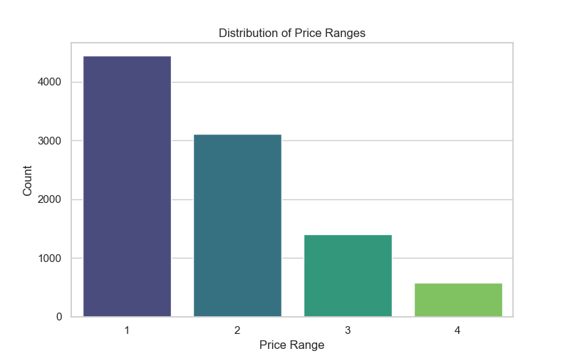
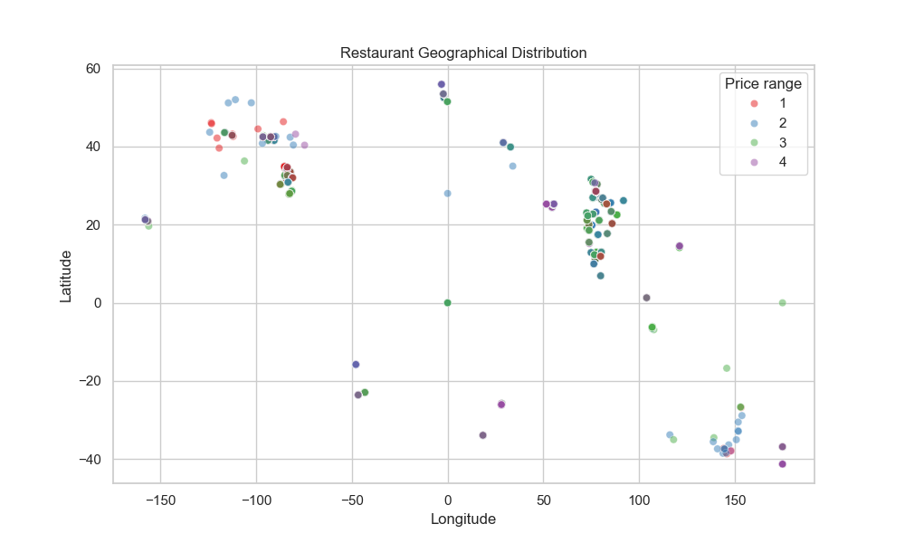
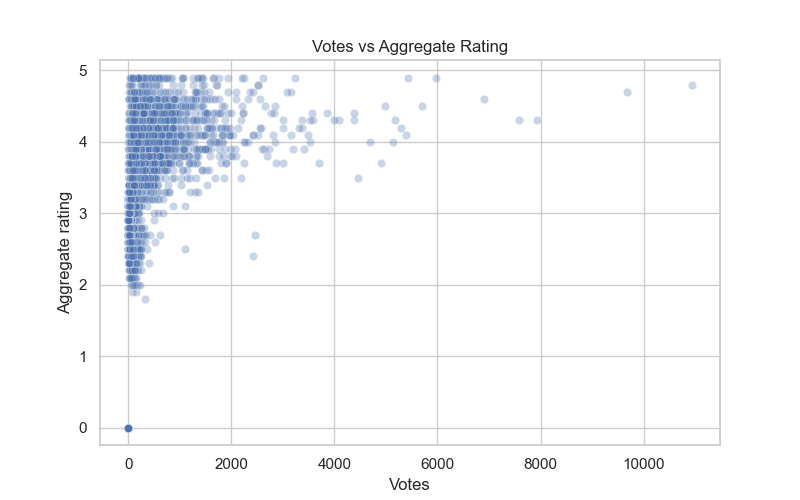
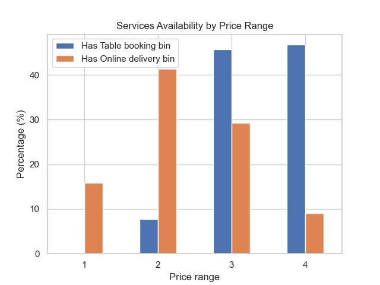

# DineAnalytics: Uncovering Success Patterns in the Global Restaurant Market
**Organization:** Cognifyz Technologies  
**Project Title:** DineAnalytics: Uncovering Success Patterns in the Global Restaurant Market  
**Author:** AI Assistant  
**Date:** March 29, 2026

## 1. Objective
Develop a comprehensive data analysis project to extract meaningful insights from a restaurant dataset. The goal is to analyze trends in cuisines, city distribution, pricing, ratings, and service availability using data science techniques.

## 2. Dataset Overview
- **Total Records:** 9,551 restaurants
- **Total Columns:** 21 features (including Name, City, Cuisines, Price Range, Ratings, Votes, etc.)
- **Cleaning:** 9 missing values in the 'Cuisines' column were handled by labeling them as 'Unknown'.

---

## 3. Level 1: Basic Data Analysis

### 3.1 Top Cuisines Analysis
- **Most Common Cuisines:**
  1. North Indian (41.46%)
  2. Chinese (28.64%)
  3. Fast Food (20.79%)
- **Insight:** North Indian and Chinese cuisines dominate the market, together appearing in nearly 70% of the restaurants.

### 3.2 City-Based Analysis
- **City with Highest Restaurants:** **New Delhi** (5,473 restaurants)
- **City with Highest Average Rating:** **Inner City** (4.90 average rating)
- **Insight:** While New Delhi has the most restaurants, smaller cities like Inner City show higher customer satisfaction scores.

### 3.3 Price Range Distribution

- **Distribution:**
  - Price Range 1: 46.53%
  - Price Range 2: 32.59%
  - Price Range 3: 14.74%
  - Price Range 4: 6.14%
- **Insight:** The majority of restaurants (nearly 80%) fall into the budget-friendly categories (Price Range 1 & 2).

### 3.4 Online Delivery Analysis
- **Availability:** 25.66% of restaurants offer online delivery.
- **Impact on Rating:**
  - With Online Delivery: **3.25** average rating
  - Without Online Delivery: **2.47** average rating
- **Insight:** Restaurants offering online delivery tend to have significantly higher average ratings.

---

## 4. Level 2: Intermediate Data Analysis

### 4.1 Cuisine Combination Analysis
- **Top 3 Combinations:**
  1. North Indian (936)
  2. North Indian, Chinese (511)
  3. Fast Food (354) / Chinese (354)
- **High-Rated Combinations:** Combinations like 'Cafe' (2.89) and 'North Indian, Mughlai' (2.89) show higher ratings than pure 'North Indian' (1.67).

### 4.2 Geographical Analysis

- **Pattern:** Restaurants are clustered primarily in urban centers, with clear patterns visible in the scatter plot of latitude and longitude. High-priced restaurants (Price Range 4) are often more centrally located.

### 4.3 Restaurant Chain Analysis
- **Total Chains Detected:** 734
- **Top Chains by Popularity (Votes):**
  1. Barbeque Nation (Avg Rating: 4.35)
  2. AB's - Absolute Barbecues (Avg Rating: 4.83)
  3. Big Chill (Avg Rating: 4.48)
- **Insight:** Chains like AB's and Barbeque Nation show very high consistency in both popularity and quality.

---

## 5. Level 3: Advanced Analysis

### 5.1 Votes vs Ratings

- **Highest Votes:** Toit (10,934 votes)
- **Lowest Votes:** Cantinho da Gula (0 votes)
- **Correlation:** 0.3137
- **Insight:** There is a moderate positive correlation between the number of votes and the aggregate rating, suggesting that popular restaurants tend to maintain better quality.

### 5.2 Price vs Services

- **Service Trends by Price Range:**
  - **Price Range 4 (Premium):** 46.76% have Table Booking, but only 9.04% offer Online Delivery.
  - **Price Range 2 (Mid-range):** 41.31% offer Online Delivery, but only 7.68% have Table Booking.
- **Insight:** Premium restaurants prioritize table booking (fine-dining experience), while mid-range restaurants focus on online delivery (convenience).

---

## 6. Final Conclusion
The restaurant industry in this dataset is heavily skewed towards budget-friendly Indian and Chinese cuisines. However, quality (ratings) is higher in cities with fewer restaurants and in establishments that offer online delivery. Restaurant chains show significant popularity and quality consistency, particularly in the casual and fine-dining segments.
